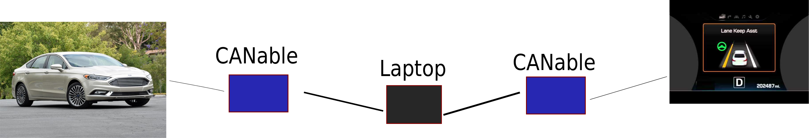

# Experiments Ford Fusion

##2017-02-15

command to filter ids in .log file in candump format

```sh
cat candump_files/amarillo.log | awk -F " " '{print $3}' | grep '4B0#\|202#' | python send_v2.py
```

Other notes:
* 202 id is related with steering command
* 216 id is related with GPS coordinates


##2017-02-16

I tried this command:

```sh
cat candump_files/amarillo.log | awk -F " " '{print $3}' | grep '186#\|18A#\|085#\|091#\|092#\|3CA#\|422#\|3A8#\|167#\|202#' | python send_v2.py
```

The command made the steeering wheel move a little bit. However, the pre-collision system was desactivated, the assistant break for slopes was desactivated. I tried the same command a second time, but there was no response of the steering wheel. The important parameters in the python script were:

* frame_repeat_period 0.0005
* frame_repeat_times 2

Apparently, the previous command move a little bit the steering wheel, but not always move it with the same angle 

Playing the frames from amarillo.log, using *frame_repeat_period* 0.01 and *frame_repeat_times* 1, provided the following results:

* 76: It shows sort of a steering wheel angle report.
* 415: Desactivated the transmission gear, reports speed, enable parking break in parking mode. It seems the command accelerates the car.
* 3CA: possible command for steering control?
* 216: moved GPS ? it activated the sonars in the panel.

##2017-02-17

The following ids were discovered:
* 186: brake activated
* 3D8: shows the lane keep assist

* note: put arguments in python script !important

all ids tested for lane keep assist:

'76#\|3A8#\|186#\|18A#\|085#\|091#\|092#\|3CA#\|422#\|3A8#\|167#\|202#\|78#\|217#\|047#\|165#\|200#\|202#\|204#\|230#\|085#\|091#\|3CD#\|3CA#\|082#'

dangerous ids: 167#\|202#\|78#\|217#\|047#\|165#\|200#\|202#\|204#\|230#\|085#\|091#\|3CD#\|3CA#\|082#

Today, we were re-playing dump files and removing ids every time. We were pruning ids until get the desired effect. The experiments were performed at the beach. We did the experiments for the lane keep assist and the controlling brake. 

```sh
cat ahorasilkas.log | grep -v '76#\|3A8#\|186#\|18A#\|085#\|091#\|092#\|3CA#\|422#\|3A8#\|167#\|202#\|415#\|78#\|217#\|047#\|165#\|200#\|202#\|204#\|230#\|085#\|091#\|3CD#\|3CA#' | canplayer -g 20
```

The previous command was used to remove ids in the logfile, and send the other using canplayer. We were adding patterns in grep command in order to discard not interesting ids

##2017-03-04

We used this command to try to see the moves of the steering wheel

```sh
cat candump_files/amarillo.log | awk -F " " '{print $3}' | grep -v '415#\|091#' | python send_v2.py -frp 0.0005 -frt 1
```
the command didn't show any good response for the steering wheel.

We tried something different. We stayed in the car with the brake pressed  and used the following command

```sh
cat candump_files/amarillo.log | awk -F " " '{print $3}' | grep  -v '415#' | python send_v2.py -frp 0.0004 -frt 1
```
We saw the steering wheel move a little bit, but in that experiment the steering wheel was turned to the right.

With this command the car disables many systems
```sh
cat candump_files/amarillo.log | awk -F " " '{print $3}' | grep  -v '415#\|077#' | python send_v2.py -frp 0.0005 -frt 1
```

With this command the car does not disable the systems but makes weird sounds with the transmission. Apparently the message id 91# is related with the disabling the systems. We turned on the car and move the steering wheel after using this command and the systems were damaged.

```sh
cat candump_files/amarillo.log | awk -F " " '{print $3}' | grep  -v '415#\|077#\|091#' | python send_v2.py -frp 0.0005 -frt 1
```

Staying in a slope we executed the following command and the car got accelerated and moved a little bit forward the sppedometer. However, maybe it is not the command to control the speed.

```sh
cat candump_files/amarillo.log | awk -F " " '{print $3}' | grep '415#' | python send_v2.py -frp 0.01 -frt 1
```

##2017-03-05

We tried to change the colors of the Lane Keep Assist using the ID `3D8`. The following command put green in the left line and yellow in the right line, but additionally activated hibeam.

```sh
echo "3D8#0000000080C5A840" | python send_v2.py -frp 0.01 -frt 1
echo "3D8#0000000080C5A850" | python send_v2.py -frp 0.01 -frt 1
echo "3D8#0000000080C5A860" | python send_v2.py -frp 0.01 -frt 1
echo "3D8#0000000080C5A870" | python send_v2.py -frp 0.01 -frt 1
```

We tried the following command. The car showed a message telling me "keep hands in the steering wheel" and also showed the green and yellow lines.

```sh
echo "3D8#0000000080C5AA30" | python send_v2.py -frp 0.01 -frt 1
echo "3D8#0000000080C5AB30" | python send_v2.py -frp 0.01 -frt 1
```
The command does not show the message, but it shows the the green and the yellow lines.

```sh
echo "3D8#0000000080C5AE30" | python send_v2.py -frp 0.01 -frt 1
echo "3D8#0000000080C5AF30" | python send_v2.py -frp 0.01 -frt 1
```

The command does not show the green and the yellow lines
```sh
echo "3D8#0000000080C5A730" | python send_v2.py -frp 0.01 -frt 1
echo "3D8#0000000080C5A630" | python send_v2.py -frp 0.01 -frt 1
echo "3D8#0000000080C5A530" | python send_v2.py -frp 0.01 -frt 1
echo "3D8#0000000080C5A430" | python send_v2.py -frp 0.01 -frt 1
echo "3D8#0000000080C5C830" | python send_v2.py -frp 0.01 -frt 1
echo "3D8#0000000080C5D830" | python send_v2.py -frp 0.01 -frt 1
echo "3D8#0000000080C5E830" | python send_v2.py -frp 0.01 -frt 1
echo "3D8#0000000080C5F830" | python send_v2.py -frp 0.01 -frt 1
```

the command put the right line in green
```sh
echo "3D8#0000000080C53830" | python send_v2.py -frp 0.01 -frt 1
```

the command put the right line in green and the left line in yellow
```sh
echo "3D8#0000000080C54830" | python send_v2.py -frp 0.01 -frt 1
```

the command put the left line in green
```sh
echo "3D8#0000000080C55830" | python send_v2.py -frp 0.01 -frt 1
```

the command put the left line in red
```sh
echo "3D8#0000000080C56830" | python send_v2.py -frp 0.01 -frt 1
```

the command put the right line in red
```sh
echo "3D8#0000000080C58830" | python send_v2.py -frp 0.01 -frt 1
```

the command showed a warning of alert tired driver rest sugested
```sh
echo "3D8#0000000080C8A830" | python send_v2.py -frp 0.01 -frt 1
```

the command showed a message of rest now
```sh
echo "3D8#0000000080F5A830" | python send_v2.py -frp 0.01 -frt 1
```

the command showed the status of lane keep assist
```sh
echo "3D8#0000000080F5A830" | python send_v2.py -frp 0.01 -frt 1
```

the command showed the status of the front camera
```sh
echo "3D8#0000000084C5A830" | python send_v2.py -frp 0.01 -frt 1
```

the command showed low visibility for the front camera
```sh
echo "3D8#0000000088C5A830" | python send_v2.py -frp 0.01 -frt 1
```
##2017-03-06

* DO NOT MAKE EXPERIMENTS AGAIN WITH THE CAR STATIONARY 

##2017-03-09

*plan1:* Connect two CANable devices, one for the car and the other for the lane keep assist. The two CANable are going to the be connected by a Laptop (see Figure below)



The main goal is to make a bridge between the two CANable devices and expect that everything is working fine. We can try this in different ways:

* Using can-utils tools from linux
* Using canard with python 
* Creating a firmware for the CANable device
